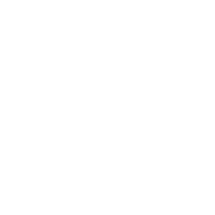
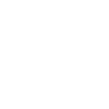
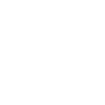
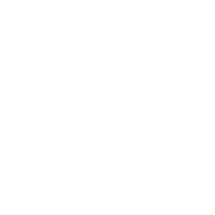

# White Icons Gallery

All image paths are relative to the root directory  
`C:/Users/Jack/OneDrive/10 - Github/tabletop-icons`

## Factions

### Chaos

<table>
  <tr>
    <td align="center">
      <picture>
        <source media="(prefers-color-scheme: dark)" srcset="white/factions/chaos/clans-pestilens.svg">
        <source media="(prefers-color-scheme: light)" srcset="black/factions/chaos/clans-pestilens.svg">
        
      </picture>
    </td>
    <td align="center">
      <picture>
        <source media="(prefers-color-scheme: dark)" srcset="white/factions/chaos/brayherds.svg">
        <source media="(prefers-color-scheme: light)" srcset="black/factions/chaos/brayherds.svg">
        
      </picture>
    </td>
    <td align="center">
      <picture>
        <source media="(prefers-color-scheme: dark)" srcset="white/factions/chaos/clans-skryre.svg">
        <source media="(prefers-color-scheme: light)" srcset="black/factions/chaos/clans-skryre.svg">
        
      </picture>
    </td>
    <td align="center">
      <picture>
        <source media="(prefers-color-scheme: dark)" srcset="white/factions/chaos/clans-eshin.svg">
        <source media="(prefers-color-scheme: light)" srcset="black/factions/chaos/clans-eshin.svg">
        
      </picture>
    </td>
    <td align="center">
      <picture>
        <source media="(prefers-color-scheme: dark)" srcset="white/factions/chaos/clans-moulder.svg">
        <source media="(prefers-color-scheme: light)" srcset="black/factions/chaos/clans-moulder.svg">
        
      </picture>
    </td>
  </tr>
</table>

### Order

#### Lumineth Castes

<table>
  <tr>
    <td align="center">
      <picture>
        <source media="(prefers-color-scheme: dark)" srcset="white/factions/order/lumineth-castes/alaithi.svg">
        <source media="(prefers-color-scheme: light)" srcset="black/factions/order/lumineth-castes/alaithi.svg">
        
      </picture>
    </td>
    <td align="center">
      <picture>
        <source media="(prefers-color-scheme: dark)" srcset="white/factions/order/lumineth-castes/oreali.svg">
        <source media="(prefers-color-scheme: light)" srcset="black/factions/order/lumineth-castes/oreali.svg">
        
      </picture>
    </td>
    <td align="center">
      <picture>
        <source media="(prefers-color-scheme: dark)" srcset="white/factions/order/lumineth-castes/senlui.svg">
        <source media="(prefers-color-scheme: light)" srcset="black/factions/order/lumineth-castes/senlui.svg">
        
      </picture>
    </td>
    <td align="center">
      <picture>
        <source media="(prefers-color-scheme: dark)" srcset="white/factions/order/lumineth-castes/thalari.svg">
        <source media="(prefers-color-scheme: light)" srcset="black/factions/order/lumineth-castes/thalari.svg">
        
      </picture>
    </td>
    <td align="center">
      <picture>
        <source media="(prefers-color-scheme: dark)" srcset="white/factions/order/lumineth-castes/ydriliqi.svg">
        <source media="(prefers-color-scheme: light)" srcset="black/factions/order/lumineth-castes/ydriliqi.svg">
        
      </picture>
    </td>
  </tr>
</table>

#### Free Peoples

<table>
  <tr>
    <td align="center">
      <picture>
        <source media="(prefers-color-scheme: dark)" srcset="white/factions/order/free-peoples/dispossessed.svg">
        <source media="(prefers-color-scheme: light)" srcset="black/factions/order/free-peoples/dispossessed.svg">
        
      </picture>
    </td>
    <td align="center">
      <picture>
        <source media="(prefers-color-scheme: dark)" srcset="white/factions/order/free-peoples/wanderers.svg">
        <source media="(prefers-color-scheme: light)" srcset="black/factions/order/free-peoples/wanderers.svg">
        
      </picture>
    </td>
    <td align="center">
      <picture>
        <source media="(prefers-color-scheme: dark)" srcset="white/factions/order/free-peoples/freeguilds.svg">
        <source media="(prefers-color-scheme: light)" srcset="black/factions/order/free-peoples/freeguilds.svg">
        
      </picture>
    </td>
    <td align="center">
      <picture>
        <source media="(prefers-color-scheme: dark)" srcset="white/factions/order/free-peoples/order-serpentis.svg">
        <source media="(prefers-color-scheme: light)" srcset="black/factions/order/free-peoples/order-serpentis.svg">
        
      </picture>
    </td>
    <td align="center">
      <picture>
        <source media="(prefers-color-scheme: dark)" srcset="white/factions/order/free-peoples/eldritch-council.svg">
        <source media="(prefers-color-scheme: light)" srcset="black/factions/order/free-peoples/eldritch-council.svg">
        
      </picture>
    </td>
    <td align="center">
      <picture>
        <source media="(prefers-color-scheme: dark)" srcset="white/factions/order/free-peoples/darkling-covens.svg">
        <source media="(prefers-color-scheme: light)" srcset="black/factions/order/free-peoples/darkling-covens.svg">
        
      </picture>
    </td>
    <td align="center">
      <picture>
        <source media="(prefers-color-scheme: dark)" srcset="white/factions/order/free-peoples/shadowblades.svg">
        <source media="(prefers-color-scheme: light)" srcset="black/factions/order/free-peoples/shadowblades.svg">
        
      </picture>
    </td>
    <td align="center">
      <picture>
        <source media="(prefers-color-scheme: dark)" srcset="white/factions/order/free-peoples/devoted-of-sigmar.svg">
        <source media="(prefers-color-scheme: light)" srcset="black/factions/order/free-peoples/devoted-of-sigmar.svg">
        
      </picture>
    </td>
  </tr>
  <tr>
    <td align="center">
      <picture>
        <source media="(prefers-color-scheme: dark)" srcset="white/factions/order/free-peoples/collegiate-arcane.svg">
        <source media="(prefers-color-scheme: light)" srcset="black/factions/order/free-peoples/collegiate-arcane.svg">
        
      </picture>
    </td>
    <td align="center">
      <picture>
        <source media="(prefers-color-scheme: dark)" srcset="white/factions/order/free-peoples/scourge-privateers.svg">
        <source media="(prefers-color-scheme: light)" srcset="black/factions/order/free-peoples/scourge-privateers.svg">
        
      </picture>
    </td>
    <td align="center">
      <picture>
        <source media="(prefers-color-scheme: dark)" srcset="white/factions/order/free-peoples/lion-rangers.svg">
        <source media="(prefers-color-scheme: light)" srcset="black/factions/order/free-peoples/lion-rangers.svg">
        
      </picture>
    </td>
    <td align="center">
      <picture>
        <source media="(prefers-color-scheme: dark)" srcset="white/factions/order/free-peoples/order-draconis.svg">
        <source media="(prefers-color-scheme: light)" srcset="black/factions/order/free-peoples/order-draconis.svg">
        
      </picture>
    </td>
    <td align="center">
      <picture>
        <source media="(prefers-color-scheme: dark)" srcset="white/factions/order/free-peoples/ironweld-arsenal.svg">
        <source media="(prefers-color-scheme: light)" srcset="black/factions/order/free-peoples/ironweld-arsenal.svg">
        
      </picture>
    </td>
    <td align="center">
      <picture>
        <source media="(prefers-color-scheme: dark)" srcset="white/factions/order/free-peoples/swifthawk-agents.svg">
        <source media="(prefers-color-scheme: light)" srcset="black/factions/order/free-peoples/swifthawk-agents.svg">
        
      </picture>
    </td>
  </tr>
</table>

#### Cities Of Sigmar

<table>
  <tr>
    <td align="center">
      <picture>
        <source media="(prefers-color-scheme: dark)" srcset="white/factions/order/cities-of-sigmar/anvilgard.svg">
        <source media="(prefers-color-scheme: light)" srcset="black/factions/order/cities-of-sigmar/anvilgard.svg">
        
      </picture>
    </td>
    <td align="center">
      <picture>
        <source media="(prefers-color-scheme: dark)" srcset="white/factions/order/cities-of-sigmar/living-city.svg">
        <source media="(prefers-color-scheme: light)" srcset="black/factions/order/cities-of-sigmar/living-city.svg">
        
      </picture>
    </td>
    <td align="center">
      <picture>
        <source media="(prefers-color-scheme: dark)" srcset="white/factions/order/cities-of-sigmar/hallowheart.svg">
        <source media="(prefers-color-scheme: light)" srcset="black/factions/order/cities-of-sigmar/hallowheart.svg">
        
      </picture>
    </td>
    <td align="center">
      <picture>
        <source media="(prefers-color-scheme: dark)" srcset="white/factions/order/cities-of-sigmar/phoenicium.svg">
        <source media="(prefers-color-scheme: light)" srcset="black/factions/order/cities-of-sigmar/phoenicium.svg">
        
      </picture>
    </td>
    <td align="center">
      <picture>
        <source media="(prefers-color-scheme: dark)" srcset="white/factions/order/cities-of-sigmar/settlers-gain.svg">
        <source media="(prefers-color-scheme: light)" srcset="black/factions/order/cities-of-sigmar/settlers-gain.svg">
        
      </picture>
    </td>
    <td align="center">
      <picture>
        <source media="(prefers-color-scheme: dark)" srcset="white/factions/order/cities-of-sigmar/hammerhal.svg">
        <source media="(prefers-color-scheme: light)" srcset="black/factions/order/cities-of-sigmar/hammerhal.svg">
        
      </picture>
    </td>
    <td align="center">
      <picture>
        <source media="(prefers-color-scheme: dark)" srcset="white/factions/order/cities-of-sigmar/greywater-fastness.svg">
        <source media="(prefers-color-scheme: light)" srcset="black/factions/order/cities-of-sigmar/greywater-fastness.svg">
        
      </picture>
    </td>
    <td align="center">
      <picture>
        <source media="(prefers-color-scheme: dark)" srcset="white/factions/order/cities-of-sigmar/tempests-eye.svg">
        <source media="(prefers-color-scheme: light)" srcset="black/factions/order/cities-of-sigmar/tempests-eye.svg">
        
      </picture>
    </td>
  </tr>
</table>

#### Order (Direct Files)

<table>
  <tr>
    <td align="center">
      <picture>
        <source media="(prefers-color-scheme: dark)" srcset="white/factions/order/lumineth-realmlords.svg">
        <source media="(prefers-color-scheme: light)" srcset="black/factions/order/lumineth-realmlords.svg">
        
      </picture>
    </td>
    <td align="center">
      <picture>
        <source media="(prefers-color-scheme: dark)" srcset="white/factions/order/seraphon.svg">
        <source media="(prefers-color-scheme: light)" srcset="black/factions/order/seraphon.svg">
        
      </picture>
    </td>
    <td align="center">
      <picture>
        <source media="(prefers-color-scheme: dark)" srcset="white/factions/order/idoneth-deepkin.svg">
        <source media="(prefers-color-scheme: light)" srcset="black/factions/order/idoneth-deepkin.svg">
        
      </picture>
    </td>
    <td align="center">
      <picture>
        <source media="(prefers-color-scheme: dark)" srcset="white/factions/order/daughters-of-khaine.svg">
        <source media="(prefers-color-scheme: light)" srcset="black/factions/order/daughters-of-khaine.svg">
        
      </picture>
    </td>
    <td align="center">
      <picture>
        <source media="(prefers-color-scheme: dark)" srcset="white/factions/order/stormcast-eternals-sacrosanct.svg">
        <source media="(prefers-color-scheme: light)" srcset="black/factions/order/stormcast-eternals-sacrosanct.svg">
        
      </picture>
    </td>
    <td align="center">
      <picture>
        <source media="(prefers-color-scheme: dark)" srcset="white/factions/order/thunderstrike-stormcasts.svg">
        <source media="(prefers-color-scheme: light)" srcset="black/factions/order/thunderstrike-stormcasts.svg">
        
      </picture>
    </td>
    <td align="center">
      <picture>
        <source media="(prefers-color-scheme: dark)" srcset="white/factions/order/fyreslayers.svg">
        <source media="(prefers-color-scheme: light)" srcset="black/factions/order/fyreslayers.svg">
        
      </picture>
    </td>
    <td align="center">
      <picture>
        <source media="(prefers-color-scheme: dark)" srcset="white/factions/order/sylvaneth.svg">
        <source media="(prefers-color-scheme: light)" srcset="black/factions/order/sylvaneth.svg">
        
      </picture>
    </td>
  </tr>
  <tr>
    <td align="center">
      <picture>
        <source media="(prefers-color-scheme: dark)" srcset="white/factions/order/stormcast-eternals-warrior.svg">
        <source media="(prefers-color-scheme: light)" srcset="black/factions/order/stormcast-eternals-warrior.svg">
        
      </picture>
    </td>
    <td align="center">
      <picture>
        <source media="(prefers-color-scheme: dark)" srcset="white/factions/order/stormcast-eternals.svg">
        <source media="(prefers-color-scheme: light)" srcset="black/factions/order/stormcast-eternals.svg">
        
      </picture>
    </td>
    <td align="center">
      <picture>
        <source media="(prefers-color-scheme: dark)" srcset="white/factions/order/kharadron-overlords.svg">
        <source media="(prefers-color-scheme: light)" srcset="black/factions/order/kharadron-overlords.svg">
        
      </picture>
    </td>
    <td align="center">
      <picture>
        <source media="(prefers-color-scheme: dark)" srcset="white/factions/order/fyreslayers-2.svg">
        <source media="(prefers-color-scheme: light)" srcset="black/factions/order/fyreslayers-2.svg">
        
      </picture>
    </td>
    <td align="center">
      <picture>
        <source media="(prefers-color-scheme: dark)" srcset="white/factions/order/kurnothi.svg">
        <source media="(prefers-color-scheme: light)" srcset="black/factions/order/kurnothi.svg">
        
      </picture>
    </td>
  </tr>
</table>

### Destruction

<table>
  <tr>
    <td align="center">
      <picture>
        <source media="(prefers-color-scheme: dark)" srcset="white/factions/destruction/gloomspite-gitz.svg">
        <source media="(prefers-color-scheme: light)" srcset="black/factions/destruction/gloomspite-gitz.svg">
        
      </picture>
    </td>
    <td align="center">
      <picture>
        <source media="(prefers-color-scheme: dark)" srcset="white/factions/destruction/ironjawz.svg">
        <source media="(prefers-color-scheme: light)" srcset="black/factions/destruction/ironjawz.svg">
        
      </picture>
    </td>
    <td align="center">
      <picture>
        <source media="(prefers-color-scheme: dark)" srcset="white/factions/destruction/kruleboyz-alternative.svg">
        <source media="(prefers-color-scheme: light)" srcset="black/factions/destruction/kruleboyz-alternative.svg">
        
      </picture>
    </td>
    <td align="center">
      <picture>
        <source media="(prefers-color-scheme: dark)" srcset="white/factions/destruction/moonclan.svg">
        <source media="(prefers-color-scheme: light)" srcset="black/factions/destruction/moonclan.svg">
        
      </picture>
    </td>
    <td align="center">
      <picture>
        <source media="(prefers-color-scheme: dark)" srcset="white/factions/destruction/ogor-mawtribes.svg">
        <source media="(prefers-color-scheme: light)" srcset="black/factions/destruction/ogor-mawtribes.svg">
        
      </picture>
    </td>
    <td align="center">
      <picture>
        <source media="(prefers-color-scheme: dark)" srcset="white/factions/destruction/fimirach.svg">
        <source media="(prefers-color-scheme: light)" srcset="black/factions/destruction/fimirach.svg">
        
      </picture>
    </td>
    <td align="center">
      <picture>
        <source media="(prefers-color-scheme: dark)" srcset="white/factions/destruction/bonesplitterz.svg">
        <source media="(prefers-color-scheme: light)" srcset="black/factions/destruction/bonesplitterz.svg">
        
      </picture>
    </td>
    <td align="center">
      <picture>
        <source media="(prefers-color-scheme: dark)" srcset="white/factions/destruction/gutbusters.svg">
        <source media="(prefers-color-scheme: light)" srcset="black/factions/destruction/gutbusters.svg">
        
      </picture>
    </td>
  </tr>
  <tr>
    <td align="center">
      <picture>
        <source media="(prefers-color-scheme: dark)" srcset="white/factions/destruction/wild-cave-creatures.svg">
        <source media="(prefers-color-scheme: light)" srcset="black/factions/destruction/wild-cave-creatures.svg">
        
      </picture>
    </td>
    <td align="center">
      <picture>
        <source media="(prefers-color-scheme: dark)" srcset="white/factions/destruction/greenskinz.svg">
        <source media="(prefers-color-scheme: light)" srcset="black/factions/destruction/greenskinz.svg">
        
      </picture>
    </td>
    <td align="center">
      <picture>
        <source media="(prefers-color-scheme: dark)" srcset="white/factions/destruction/stoneclaws-gutstompas.svg">
        <source media="(prefers-color-scheme: light)" srcset="black/factions/destruction/stoneclaws-gutstompas.svg">
        
      </picture>
    </td>
    <td align="center">
      <picture>
        <source media="(prefers-color-scheme: dark)" srcset="white/factions/destruction/beastclaw-raiders.svg">
        <source media="(prefers-color-scheme: light)" srcset="black/factions/destruction/beastclaw-raiders.svg">
        
      </picture>
    </td>
    <td align="center">
      <picture>
        <source media="(prefers-color-scheme: dark)" srcset="white/factions/destruction/kruleboyz.svg">
        <source media="(prefers-color-scheme: light)" srcset="black/factions/destruction/kruleboyz.svg">
        
      </picture>
    </td>
    <td align="center">
      <picture>
        <source media="(prefers-color-scheme: dark)" srcset="white/factions/destruction/sons-of-behemat.svg">
        <source media="(prefers-color-scheme: light)" srcset="black/factions/destruction/sons-of-behemat.svg">
        
      </picture>
    </td>
    <td align="center">
      <picture>
        <source media="(prefers-color-scheme: dark)" srcset="white/factions/destruction/spiderfang.svg">
        <source media="(prefers-color-scheme: light)" srcset="black/factions/destruction/spiderfang.svg">
        
      </picture>
    </td>
    <td align="center">
      <picture>
        <source media="(prefers-color-scheme: dark)" srcset="white/factions/destruction/aleguzzlers.svg">
        <source media="(prefers-color-scheme: light)" srcset="black/factions/destruction/aleguzzlers.svg">
        
      </picture>
    </td>
  </tr>
  <tr>
    <td align="center">
      <picture>
        <source media="(prefers-color-scheme: dark)" srcset="white/factions/destruction/gitmob.svg">
        <source media="(prefers-color-scheme: light)" srcset="black/factions/destruction/gitmob.svg">
        
      </picture>
    </td>
  </tr>
</table>

### Death

<table>
  <tr>
    <td align="center">
      <picture>
        <source media="(prefers-color-scheme: dark)" srcset="white/factions/death/legions-of-nagash.svg">
        <source media="(prefers-color-scheme: light)" srcset="black/factions/death/legions-of-nagash.svg">
        
      </picture>
    </td>
    <td align="center">
      <picture>
        <source media="(prefers-color-scheme: dark)" srcset="white/factions/death/ossiarch-bonereapers.svg">
        <source media="(prefers-color-scheme: light)" srcset="black/factions/death/ossiarch-bonereapers.svg">
        
      </picture>
    </td>
    <td align="center">
      <picture>
        <source media="(prefers-color-scheme: dark)" srcset="white/factions/death/restless-dead.svg">
        <source media="(prefers-color-scheme: light)" srcset="black/factions/death/restless-dead.svg">
        
      </picture>
    </td>
    <td align="center">
      <picture>
        <source media="(prefers-color-scheme: dark)" srcset="white/factions/death/flesh-eater-courts.svg">
        <source media="(prefers-color-scheme: light)" srcset="black/factions/death/flesh-eater-courts.svg">
        
      </picture>
    </td>
    <td align="center">
      <picture>
        <source media="(prefers-color-scheme: dark)" srcset="white/factions/death/nighthaunt.svg">
        <source media="(prefers-color-scheme: light)" srcset="black/factions/death/nighthaunt.svg">
        
      </picture>
    </td>
    <td align="center">
      <picture>
        <source media="(prefers-color-scheme: dark)" srcset="white/factions/death/soulblight.svg">
        <source media="(prefers-color-scheme: light)" srcset="black/factions/death/soulblight.svg">
        
      </picture>
    </td>
    <td align="center">
      <picture>
        <source media="(prefers-color-scheme: dark)" srcset="white/factions/death/wraith-fleet.svg">
        <source media="(prefers-color-scheme: light)" srcset="black/factions/death/wraith-fleet.svg">
        
      </picture>
    </td>
    <td align="center">
      <picture>
        <source media="(prefers-color-scheme: dark)" srcset="white/factions/death/soulblight-gravelords.svg">
        <source media="(prefers-color-scheme: light)" srcset="black/factions/death/soulblight-gravelords.svg">
        
      </picture>
    </td>
  </tr>
</table>

### Grand Alliances

<table>
  <tr>
    <td align="center">
      <picture>
        <source media="(prefers-color-scheme: dark)" srcset="white/factions/grand-alliances/death.svg">
        <source media="(prefers-color-scheme: light)" srcset="black/factions/grand-alliances/death.svg">
        
      </picture>
    </td>
    <td align="center">
      <picture>
        <source media="(prefers-color-scheme: dark)" srcset="white/factions/grand-alliances/chaos.svg">
        <source media="(prefers-color-scheme: light)" srcset="black/factions/grand-alliances/chaos.svg">
        
      </picture>
    </td>
    <td align="center">
      <picture>
        <source media="(prefers-color-scheme: dark)" srcset="white/factions/grand-alliances/order.svg">
        <source media="(prefers-color-scheme: light)" srcset="black/factions/grand-alliances/order.svg">
        
      </picture>
    </td>
    <td align="center">
      <picture>
        <source media="(prefers-color-scheme: dark)" srcset="white/factions/grand-alliances/destruction.svg">
        <source media="(prefers-color-scheme: light)" srcset="black/factions/grand-alliances/destruction.svg">
        
      </picture>
    </td>
  </tr>
</table>

### Monsters

<table>
  <tr>
    <td align="center">
      <picture>
        <source media="(prefers-color-scheme: dark)" srcset="white/factions/monsters/monster-of-destruction.svg">
        <source media="(prefers-color-scheme: light)" srcset="black/factions/monsters/monster-of-destruction.svg">
        
      </picture>
    </td>
    <td align="center">
      <picture>
        <source media="(prefers-color-scheme: dark)" srcset="white/factions/monsters/monster-of-order.svg">
        <source media="(prefers-color-scheme: light)" srcset="black/factions/monsters/monster-of-order.svg">
        
      </picture>
    </td>
    <td align="center">
      <picture>
        <source media="(prefers-color-scheme: dark)" srcset="white/factions/monsters/monster-of-death.svg">
        <source media="(prefers-color-scheme: light)" srcset="black/factions/monsters/monster-of-death.svg">
        
      </picture>
    </td>
    <td align="center">
      <picture>
        <source media="(prefers-color-scheme: dark)" srcset="white/factions/monsters/chaotic-beast.svg">
        <source media="(prefers-color-scheme: light)" srcset="black/factions/monsters/chaotic-beast.svg">
        
      </picture>
    </td>
  </tr>
</table>

### Allies

<table>
  <tr>
    <td align="center">
      <picture>
        <source media="(prefers-color-scheme: dark)" srcset="white/factions/allies/gloomspite-gitz-ally.svg">
        <source media="(prefers-color-scheme: light)" srcset="black/factions/allies/gloomspite-gitz-ally.svg">
        
      </picture>
    </td>
    <td align="center">
      <picture>
        <source media="(prefers-color-scheme: dark)" srcset="white/factions/allies/beasts-of-chaos-ally.svg">
        <source media="(prefers-color-scheme: light)" srcset="black/factions/allies/beasts-of-chaos-ally.svg">
        
      </picture>
    </td>
    <td align="center">
      <picture>
        <source media="(prefers-color-scheme: dark)" srcset="white/factions/allies/slaves-to-darkness-ally.svg">
        <source media="(prefers-color-scheme: light)" srcset="black/factions/allies/slaves-to-darkness-ally.svg">
        
      </picture>
    </td>
    <td align="center">
      <picture>
        <source media="(prefers-color-scheme: dark)" srcset="white/factions/allies/nurgle-ally.svg">
        <source media="(prefers-color-scheme: light)" srcset="black/factions/allies/nurgle-ally.svg">
        
      </picture>
    </td>
    <td align="center">
      <picture>
        <source media="(prefers-color-scheme: dark)" srcset="white/factions/allies/bonesplitterz-ally.svg">
        <source media="(prefers-color-scheme: light)" srcset="black/factions/allies/bonesplitterz-ally.svg">
        
      </picture>
    </td>
    <td align="center">
      <picture>
        <source media="(prefers-color-scheme: dark)" srcset="white/factions/allies/ironjawz-ally.svg">
        <source media="(prefers-color-scheme: light)" srcset="black/factions/allies/ironjawz-ally.svg">
        
      </picture>
    </td>
    <td align="center">
      <picture>
        <source media="(prefers-color-scheme: dark)" srcset="white/factions/allies/daughters-of-khaine-ally.svg">
        <source media="(prefers-color-scheme: light)" srcset="black/factions/allies/daughters-of-khaine-ally.svg">
        
      </picture>
    </td>
    <td align="center">
      <picture>
        <source media="(prefers-color-scheme: dark)" srcset="white/factions/allies/nighthaunt-ally.svg">
        <source media="(prefers-color-scheme: light)" srcset="black/factions/allies/nighthaunt-ally.svg">
        
      </picture>
    </td>
  </tr>
  <tr>
    <td align="center">
      <picture>
        <source media="(prefers-color-scheme: dark)" srcset="white/factions/allies/tzeentch-ally.svg">
        <source media="(prefers-color-scheme: light)" srcset="black/factions/allies/tzeentch-ally.svg">
        
      </picture>
    </td>
    <td align="center">
      <picture>
        <source media="(prefers-color-scheme: dark)" srcset="white/factions/allies/khorne-ally.svg">
        <source media="(prefers-color-scheme: light)" srcset="black/factions/allies/khorne-ally.svg">
        
      </picture>
    </td>
    <td align="center">
      <picture>
        <source media="(prefers-color-scheme: dark)" srcset="white/factions/allies/legions-of-nagash-ally.svg">
        <source media="(prefers-color-scheme: light)" srcset="black/factions/allies/legions-of-nagash-ally.svg">
        
      </picture>
    </td>
    <td align="center">
      <picture>
        <source media="(prefers-color-scheme: dark)" srcset="white/factions/allies/stormcast-warrior-ally.svg">
        <source media="(prefers-color-scheme: light)" srcset="black/factions/allies/stormcast-warrior-ally.svg">
        
      </picture>
    </td>
    <td align="center">
      <picture>
        <source media="(prefers-color-scheme: dark)" srcset="white/factions/allies/flesh-eater-courts-ally.svg">
        <source media="(prefers-color-scheme: light)" srcset="black/factions/allies/flesh-eater-courts-ally.svg">
        
      </picture>
    </td>
    <td align="center">
      <picture>
        <source media="(prefers-color-scheme: dark)" srcset="white/factions/allies/idoneth-deepkin-ally.svg">
        <source media="(prefers-color-scheme: light)" srcset="black/factions/allies/idoneth-deepkin-ally.svg">
        
      </picture>
    </td>
    <td align="center">
      <picture>
        <source media="(prefers-color-scheme: dark)" srcset="white/factions/allies/skaven-ally.svg">
        <source media="(prefers-color-scheme: light)" srcset="black/factions/allies/skaven-ally.svg">
        
      </picture>
    </td>
  </tr>
</table>

---

## Warbands

<table>
  <tr>
    <td align="center">
      <picture>
        <source media="(prefers-color-scheme: dark)" srcset="white/warbands/xandires.svg">
        <source media="(prefers-color-scheme: light)" srcset="black/warbands/xandires.svg">
        
      </picture>
    </td>
    <td align="center">
      <picture>
        <source media="(prefers-color-scheme: dark)" srcset="white/warbands/ylthari.svg">
        <source media="(prefers-color-scheme: light)" srcset="black/warbands/ylthari.svg">
        
      </picture>
    </td>
    <td align="center">
      <picture>
        <source media="(prefers-color-scheme: dark)" srcset="white/warbands/zarbag.svg">
        <source media="(prefers-color-scheme: light)" srcset="black/warbands/zarbag.svg">
        
      </picture>
    </td>
    <td align="center">
      <picture>
        <source media="(prefers-color-scheme: dark)" srcset="white/warbands/thundrik.svg">
        <source media="(prefers-color-scheme: light)" srcset="black/warbands/thundrik.svg">
        
      </picture>
    </td>
    <td align="center">
      <picture>
        <source media="(prefers-color-scheme: dark)" srcset="white/warbands/velmorn.svg">
        <source media="(prefers-color-scheme: light)" srcset="black/warbands/velmorn.svg">
        
      </picture>
    </td>
    <td align="center">
      <picture>
        <source media="(prefers-color-scheme: dark)" srcset="white/warbands/wurmspat.svg">
        <source media="(prefers-color-scheme: light)" srcset="black/warbands/wurmspat.svg">
        
      </picture>
    </td>
    <td align="center">
      <picture>
        <source media="(prefers-color-scheme: dark)" srcset="white/warbands/theheadsmen.svg">
        <source media="(prefers-color-scheme: light)" srcset="black/warbands/theheadsmen.svg">
        
      </picture>
    </td>
    <td align="center">
      <picture>
        <source media="(prefers-color-scheme: dark)" srcset="white/warbands/theexileddead.svg">
        <source media="(prefers-color-scheme: light)" srcset="black/warbands/theexileddead.svg">
        
      </picture>
    </td>
  </tr>
  <tr>
    <td align="center">
      <picture>
        <source media="(prefers-color-scheme: dark)" srcset="white/warbands/the-shadeborn.svg">
        <source media="(prefers-color-scheme: light)" srcset="black/warbands/the-shadeborn.svg">
        
      </picture>
    </td>
    <td align="center">
      <picture>
        <source media="(prefers-color-scheme: dark)" srcset="white/warbands/stormsire.svg">
        <source media="(prefers-color-scheme: light)" srcset="black/warbands/stormsire.svg">
        
      </picture>
    </td>
    <td align="center">
      <picture>
        <source media="(prefers-color-scheme: dark)" srcset="white/warbands/starblood.svg">
        <source media="(prefers-color-scheme: light)" srcset="black/warbands/starblood.svg">
        
      </picture>
    </td>
    <td align="center">
      <picture>
        <source media="(prefers-color-scheme: dark)" srcset="white/warbands/steelheart.svg">
        <source media="(prefers-color-scheme: light)" srcset="black/warbands/steelheart.svg">
        
      </picture>
    </td>
    <td align="center">
      <picture>
        <source media="(prefers-color-scheme: dark)" srcset="white/warbands/skittershanks-clawpack.svg">
        <source media="(prefers-color-scheme: light)" srcset="black/warbands/skittershanks-clawpack.svg">
        
      </picture>
    </td>
    <td align="center">
      <picture>
        <source media="(prefers-color-scheme: dark)" srcset="white/warbands/spiteclaw.svg">
        <source media="(prefers-color-scheme: light)" srcset="black/warbands/spiteclaw.svg">
        
      </picture>
    </td>
    <td align="center">
      <picture>
        <source media="(prefers-color-scheme: dark)" srcset="white/warbands/skabbiks.svg">
        <source media="(prefers-color-scheme: light)" srcset="black/warbands/skabbiks.svg">
        
      </picture>
    </td>
    <td align="center">
      <picture>
        <source media="(prefers-color-scheme: dark)" srcset="white/warbands/skaeth.svg">
        <source media="(prefers-color-scheme: light)" srcset="black/warbands/skaeth.svg">
        
      </picture>
    </td>
  </tr>
  <tr>
    <td align="center">
      <picture>
        <source media="(prefers-color-scheme: dark)" srcset="white/warbands/sepulchral.svg">
        <source media="(prefers-color-scheme: light)" srcset="black/warbands/sepulchral.svg">
        
      </picture>
    </td>
    <td align="center">
      <picture>
        <source media="(prefers-color-scheme: dark)" srcset="white/warbands/myari.svg">
        <source media="(prefers-color-scheme: light)" srcset="black/warbands/myari.svg">
        
      </picture>
    </td>
    <td align="center">
      <picture>
        <source media="(prefers-color-scheme: dark)" srcset="white/warbands/rippa.svg">
        <source media="(prefers-color-scheme: light)" srcset="black/warbands/rippa.svg">
        
      </picture>
    </td>
    <td align="center">
      <picture>
        <source media="(prefers-color-scheme: dark)" srcset="white/warbands/mollog.svg">
        <source media="(prefers-color-scheme: light)" srcset="black/warbands/mollog.svg">
        
      </picture>
    </td>
    <td align="center">
      <picture>
        <source media="(prefers-color-scheme: dark)" srcset="white/warbands/morgok.svg">
        <source media="(prefers-color-scheme: light)" srcset="black/warbands/morgok.svg">
        
      </picture>
    </td>
    <td align="center">
      <picture>
        <source media="(prefers-color-scheme: dark)" srcset="white/warbands/morgwaeth.svg">
        <source media="(prefers-color-scheme: light)" srcset="black/warbands/morgwaeth.svg">
        
      </picture>
    </td>
    <td align="center">
      <picture>
        <source media="(prefers-color-scheme: dark)" srcset="white/warbands/ironskull.svg">
        <source media="(prefers-color-scheme: light)" srcset="black/warbands/ironskull.svg">
        
      </picture>
    </td>
    <td align="center">
      <picture>
        <source media="(prefers-color-scheme: dark)" srcset="white/warbands/kainan.svg">
        <source media="(prefers-color-scheme: light)" srcset="black/warbands/kainan.svg">
        
      </picture>
    </td>
  </tr>
  <tr>
    <td align="center">
      <picture>
        <source media="(prefers-color-scheme: dark)" srcset="white/warbands/khagra.svg">
        <source media="(prefers-color-scheme: light)" srcset="black/warbands/khagra.svg">
        
      </picture>
    </td>
    <td align="center">
      <picture>
        <source media="(prefers-color-scheme: dark)" srcset="white/warbands/magore.svg">
        <source media="(prefers-color-scheme: light)" srcset="black/warbands/magore.svg">
        
      </picture>
    </td>
    <td align="center">
      <picture>
        <source media="(prefers-color-scheme: dark)" srcset="white/warbands/hrothgorn.svg">
        <source media="(prefers-color-scheme: light)" srcset="black/warbands/hrothgorn.svg">
        
      </picture>
    </td>
    <td align="center">
      <picture>
        <source media="(prefers-color-scheme: dark)" srcset="white/warbands/hexbaneshunters.svg">
        <source media="(prefers-color-scheme: light)" srcset="black/warbands/hexbaneshunters.svg">
        
      </picture>
    </td>
    <td align="center">
      <picture>
        <source media="(prefers-color-scheme: dark)" srcset="white/warbands/hedkrakka.svg">
        <source media="(prefers-color-scheme: light)" srcset="black/warbands/hedkrakka.svg">
        
      </picture>
    </td>
    <td align="center">
      <picture>
        <source media="(prefers-color-scheme: dark)" srcset="white/warbands/grysellesarenai.svg">
        <source media="(prefers-color-scheme: light)" srcset="black/warbands/grysellesarenai.svg">
        
      </picture>
    </td>
    <td align="center">
      <picture>
        <source media="(prefers-color-scheme: dark)" srcset="white/warbands/grymwatch.svg">
        <source media="(prefers-color-scheme: light)" srcset="black/warbands/grymwatch.svg">
        
      </picture>
    </td>
    <td align="center">
      <picture>
        <source media="(prefers-color-scheme: dark)" srcset="white/warbands/grinkrakslooncourt.svg">
        <source media="(prefers-color-scheme: light)" srcset="black/warbands/grinkrakslooncourt.svg">
        
      </picture>
    </td>
  </tr>
  <tr>
    <td align="center">
      <picture>
        <source media="(prefers-color-scheme: dark)" srcset="white/warbands/grashrak.svg">
        <source media="(prefers-color-scheme: light)" srcset="black/warbands/grashrak.svg">
        
      </picture>
    </td>
    <td align="center">
      <picture>
        <source media="(prefers-color-scheme: dark)" srcset="white/warbands/godsworn.svg">
        <source media="(prefers-color-scheme: light)" srcset="black/warbands/godsworn.svg">
        
      </picture>
    </td>
    <td align="center">
      <picture>
        <source media="(prefers-color-scheme: dark)" srcset="white/warbands/gorechhosen-of-dromm.svg">
        <source media="(prefers-color-scheme: light)" srcset="black/warbands/gorechhosen-of-dromm.svg">
        
      </picture>
    </td>
    <td align="center">
      <picture>
        <source media="(prefers-color-scheme: dark)" srcset="white/warbands/gnarlspirit.svg">
        <source media="(prefers-color-scheme: light)" srcset="black/warbands/gnarlspirit.svg">
        
      </picture>
    </td>
    <td align="center">
      <picture>
        <source media="(prefers-color-scheme: dark)" srcset="white/warbands/garrek.svg">
        <source media="(prefers-color-scheme: light)" srcset="black/warbands/garrek.svg">
        
      </picture>
    </td>
    <td align="center">
      <picture>
        <source media="(prefers-color-scheme: dark)" srcset="white/warbands/farstrider.svg">
        <source media="(prefers-color-scheme: light)" srcset="black/warbands/farstrider.svg">
        
      </picture>
    </td>
    <td align="center">
      <picture>
        <source media="(prefers-color-scheme: dark)" srcset="white/warbands/eyesofthenine.svg">
        <source media="(prefers-color-scheme: light)" srcset="black/warbands/eyesofthenine.svg">
        
      </picture>
    </td>
    <td align="center">
      <picture>
        <source media="(prefers-color-scheme: dark)" srcset="white/warbands/ephilims.svg">
        <source media="(prefers-color-scheme: light)" srcset="black/warbands/ephilims.svg">
        
      </picture>
    </td>
  </tr>
  <tr>
    <td align="center">
      <picture>
        <source media="(prefers-color-scheme: dark)" srcset="white/warbands/dreadpageant.svg">
        <source media="(prefers-color-scheme: light)" srcset="black/warbands/dreadpageant.svg">
        
      </picture>
    </td>
    <td align="center">
      <picture>
        <source media="(prefers-color-scheme: dark)" srcset="white/warbands/elathain.svg">
        <source media="(prefers-color-scheme: light)" srcset="black/warbands/elathain.svg">
        
      </picture>
    </td>
    <td align="center">
      <picture>
        <source media="(prefers-color-scheme: dark)" srcset="white/warbands/dakunninkrew.svg">
        <source media="(prefers-color-scheme: light)" srcset="black/warbands/dakunninkrew.svg">
        
      </picture>
    </td>
    <td align="center">
      <picture>
        <source media="(prefers-color-scheme: dark)" srcset="white/warbands/domitans.svg">
        <source media="(prefers-color-scheme: light)" srcset="black/warbands/domitans.svg">
        
      </picture>
    </td>
    <td align="center">
      <picture>
        <source media="(prefers-color-scheme: dark)" srcset="white/warbands/crimsoncourt.svg">
        <source media="(prefers-color-scheme: light)" srcset="black/warbands/crimsoncourt.svg">
        
      </picture>
    </td>
    <td align="center">
      <picture>
        <source media="(prefers-color-scheme: dark)" srcset="white/warbands/chosenaxes.svg">
        <source media="(prefers-color-scheme: light)" srcset="black/warbands/chosenaxes.svg">
        
      </picture>
    </td>
    <td align="center">
      <picture>
        <source media="(prefers-color-scheme: dark)" srcset="white/warbands/blackpowders.svg">
        <source media="(prefers-color-scheme: light)" srcset="black/warbands/blackpowders.svg">
        
      </picture>
    </td>
    <td align="center">
      <picture>
        <source media="(prefers-color-scheme: dark)" srcset="white/warbands/briarqueen.svg">
        <source media="(prefers-color-scheme: light)" srcset="black/warbands/briarqueen.svg">
        
      </picture>
    </td>
  </tr>
  <tr>
    <td align="center">
      <picture>
        <source media="(prefers-color-scheme: dark)" srcset="white/warbands/untamed-beasts.svg">
        <source media="(prefers-color-scheme: light)" srcset="black/warbands/untamed-beasts.svg">
        
      </picture>
    </td>
    <td align="center">
      <picture>
        <source media="(prefers-color-scheme: dark)" srcset="white/warbands/darkoath-savagers.svg">
        <source media="(prefers-color-scheme: light)" srcset="black/warbands/darkoath-savagers.svg">
        
      </picture>
    </td>
    <td align="center">
      <picture>
        <source media="(prefers-color-scheme: dark)" srcset="white/warbands/splintered-fang.svg">
        <source media="(prefers-color-scheme: light)" srcset="black/warbands/splintered-fang.svg">
        
      </picture>
    </td>
    <td align="center">
      <picture>
        <source media="(prefers-color-scheme: dark)" srcset="white/warbands/tarantulos-brood.svg">
        <source media="(prefers-color-scheme: light)" srcset="black/warbands/tarantulos-brood.svg">
        
      </picture>
    </td>
    <td align="center">
      <picture>
        <source media="(prefers-color-scheme: dark)" srcset="white/warbands/the-unmade.svg">
        <source media="(prefers-color-scheme: light)" srcset="black/warbands/the-unmade.svg">
        
      </picture>
    </td>
    <td align="center">
      <picture>
        <source media="(prefers-color-scheme: dark)" srcset="white/warbands/hunters-of-huanchi.svg">
        <source media="(prefers-color-scheme: light)" srcset="black/warbands/hunters-of-huanchi.svg">
        
      </picture>
    </td>
    <td align="center">
      <picture>
        <source media="(prefers-color-scheme: dark)" srcset="white/warbands/horns-of-hashut.svg">
        <source media="(prefers-color-scheme: light)" srcset="black/warbands/horns-of-hashut.svg">
        
      </picture>
    </td>
    <td align="center">
      <picture>
        <source media="(prefers-color-scheme: dark)" srcset="white/warbands/scions-of-the-flame.svg">
        <source media="(prefers-color-scheme: light)" srcset="black/warbands/scions-of-the-flame.svg">
        
      </picture>
    </td>
  </tr>
  <tr>
    <td align="center">
      <picture>
        <source media="(prefers-color-scheme: dark)" srcset="white/warbands/spire-tyrants.svg">
        <source media="(prefers-color-scheme: light)" srcset="black/warbands/spire-tyrants.svg">
        
      </picture>
    </td>
    <td align="center">
      <picture>
        <source media="(prefers-color-scheme: dark)" srcset="white/warbands/khainite-shadowstalkers.svg">
        <source media="(prefers-color-scheme: light)" srcset="black/warbands/khainite-shadowstalkers.svg">
        
      </picture>
    </td>
    <td align="center">
      <picture>
        <source media="(prefers-color-scheme: dark)" srcset="white/warbands/jade-obelisk.svg">
        <source media="(prefers-color-scheme: light)" srcset="black/warbands/jade-obelisk.svg">
        
      </picture>
    </td>
    <td align="center">
      <picture>
        <source media="(prefers-color-scheme: dark)" srcset="white/warbands/cypher-lords.svg">
        <source media="(prefers-color-scheme: light)" srcset="black/warbands/cypher-lords.svg">
        
      </picture>
    </td>
    <td align="center">
      <picture>
        <source media="(prefers-color-scheme: dark)" srcset="white/warbands/iron-golems.svg">
        <source media="(prefers-color-scheme: light)" srcset="black/warbands/iron-golems.svg">
        
      </picture>
    </td>
    <td align="center">
      <picture>
        <source media="(prefers-color-scheme: dark)" srcset="white/warbands/corvus-cabal.svg">
        <source media="(prefers-color-scheme: light)" srcset="black/warbands/corvus-cabal.svg">
        
      </picture>
    </td>
    <td align="center">
      <picture>
        <source media="(prefers-color-scheme: dark)" srcset="white/warbands/claws-of-karanak.svg">
        <source media="(prefers-color-scheme: light)" srcset="black/warbands/claws-of-karanak.svg">
        
      </picture>
    </td>
    <td align="center">
      <picture>
        <source media="(prefers-color-scheme: dark)" srcset="white/warbands/chaos-legionnaires.svg">
        <source media="(prefers-color-scheme: light)" srcset="black/warbands/chaos-legionnaires.svg">
        
      </picture>
    </td>
  </tr>
  <tr>
    <td align="center">
      <picture>
        <source media="(prefers-color-scheme: dark)" srcset="white/warbands/rotmire-creed.svg">
        <source media="(prefers-color-scheme: light)" srcset="black/warbands/rotmire-creed.svg">
        
      </picture>
    </td>
    <td align="center">
      <picture>
        <source media="(prefers-color-scheme: dark)" srcset="white/warbands/nurgle-rotbringers.svg">
        <source media="(prefers-color-scheme: light)" srcset="black/warbands/nurgle-rotbringers.svg">
        
      </picture>
    </td>
    <td align="center">
      <picture>
        <source media="(prefers-color-scheme: dark)" srcset="white/warbands/slaanesh-sybarites.svg">
        <source media="(prefers-color-scheme: light)" srcset="black/warbands/slaanesh-sybarites.svg">
        
      </picture>
    </td>
    <td align="center">
      <picture>
        <source media="(prefers-color-scheme: dark)" srcset="white/warbands/tzeentch-arcanites.svg">
        <source media="(prefers-color-scheme: light)" srcset="black/warbands/tzeentch-arcanites.svg">
        
      </picture>
    </td>
    <td align="center">
      <picture>
        <source media="(prefers-color-scheme: dark)" srcset="white/warbands/legion-of-the-first-prince.svg">
        <source media="(prefers-color-scheme: light)" srcset="black/warbands/legion-of-the-first-prince.svg">
        
      </picture>
    </td>
    <td align="center">
      <picture>
        <source media="(prefers-color-scheme: dark)" srcset="white/warbands/tzeentch-daemons.svg">
        <source media="(prefers-color-scheme: light)" srcset="black/warbands/tzeentch-daemons.svg">
        
      </picture>
    </td>
    <td align="center">
      <picture>
        <source media="(prefers-color-scheme: dark)" srcset="white/warbands/khorne-bloodbound.svg">
        <source media="(prefers-color-scheme: light)" srcset="black/warbands/khorne-bloodbound.svg">
        
      </picture>
    </td>
    <td align="center">
      <picture>
        <source media="(prefers-color-scheme: dark)" srcset="white/warbands/slaves-to-darkness.svg">
        <source media="(prefers-color-scheme: light)" srcset="black/warbands/slaves-to-darkness.svg">
        
      </picture>
    </td>
  </tr>
  <tr>
    <td align="center">
      <picture>
        <source media="(prefers-color-scheme: dark)" srcset="white/warbands/khorne-daemons.svg">
        <source media="(prefers-color-scheme: light)" srcset="black/warbands/khorne-daemons.svg">
        
      </picture>
    </td>
    <td align="center">
      <picture>
        <source media="(prefers-color-scheme: dark)" srcset="white/warbands/skaven.svg">
        <source media="(prefers-color-scheme: light)" srcset="black/warbands/skaven.svg">
        
      </picture>
    </td>
    <td align="center">
      <picture>
        <source media="(prefers-color-scheme: dark)" srcset="white/warbands/everchosen.svg">
        <source media="(prefers-color-scheme: light)" srcset="black/warbands/everchosen.svg">
        
      </picture>
    </td>
    <td align="center">
      <picture>
        <source media="(prefers-color-scheme: dark)" srcset="white/warbands/hedonites-of-slaanesh.svg">
        <source media="(prefers-color-scheme: light)" srcset="black/warbands/hedonites-of-slaanesh.svg">
        
      </picture>
    </td>
    <td align="center">
      <picture>
        <source media="(prefers-color-scheme: dark)" srcset="white/warbands/maggotkin-of-nurgle.svg">
        <source media="(prefers-color-scheme: light)" srcset="black/warbands/maggotkin-of-nurgle.svg">
        
      </picture>
    </td>
    <td align="center">
      <picture>
        <source media="(prefers-color-scheme: dark)" srcset="white/warbands/fist-of-the-everchosen.svg">
        <source media="(prefers-color-scheme: light)" srcset="black/warbands/fist-of-the-everchosen.svg">
        
      </picture>
    </td>
    <td align="center">
      <picture>
        <source media="(prefers-color-scheme: dark)" srcset="white/warbands/beasts-of-chaos.svg">
        <source media="(prefers-color-scheme: light)" srcset="black/warbands/beasts-of-chaos.svg">
        
      </picture>
    </td>
    <td align="center">
      <picture>
        <source media="(prefers-color-scheme: dark)" srcset="white/warbands/thunderscorn.svg">
        <source media="(prefers-color-scheme: light)" srcset="black/warbands/thunderscorn.svg">
        
      </picture>
    </td>
  </tr>
</table>

---

## Treasure

<table>
  <tr>
    <td align="center">
      <picture>
        <source media="(prefers-color-scheme: dark)" srcset="white/treasure/potions.svg">
        <source media="(prefers-color-scheme: light)" srcset="black/treasure/potions.svg">
        
      </picture>
    </td>
    <td align="center">
      <picture>
        <source media="(prefers-color-scheme: dark)" srcset="white/treasure/skull.svg">
        <source media="(prefers-color-scheme: light)" srcset="black/treasure/skull.svg">
        
      </picture>
    </td>
    <td align="center">
      <picture>
        <source media="(prefers-color-scheme: dark)" srcset="white/treasure/orrery.svg">
        <source media="(prefers-color-scheme: light)" srcset="black/treasure/orrery.svg">
        
      </picture>
    </td>
    <td align="center">
      <picture>
        <source media="(prefers-color-scheme: dark)" srcset="white/treasure/realmstone.svg">
        <source media="(prefers-color-scheme: light)" srcset="black/treasure/realmstone.svg">
        
      </picture>
    </td>
    <td align="center">
      <picture>
        <source media="(prefers-color-scheme: dark)" srcset="white/treasure/creature.svg">
        <source media="(prefers-color-scheme: light)" srcset="black/treasure/creature.svg">
        
      </picture>
    </td>
    <td align="center">
      <picture>
        <source media="(prefers-color-scheme: dark)" srcset="white/treasure/weapons.svg">
        <source media="(prefers-color-scheme: light)" srcset="black/treasure/weapons.svg">
        
      </picture>
    </td>
    <td align="center">
      <picture>
        <source media="(prefers-color-scheme: dark)" srcset="white/treasure/totem.svg">
        <source media="(prefers-color-scheme: light)" srcset="black/treasure/totem.svg">
        
      </picture>
    </td>
    <td align="center">
      <picture>
        <source media="(prefers-color-scheme: dark)" srcset="white/treasure/supplies.svg">
        <source media="(prefers-color-scheme: light)" srcset="black/treasure/supplies.svg">
        
      </picture>
    </td>
  </tr>
</table>

---

## Weapons

<table>
  <tr>
    <td align="center">
      <picture>
        <source media="(prefers-color-scheme: dark)" srcset="white/weapons/sword.svg">
        <source media="(prefers-color-scheme: light)" srcset="black/weapons/sword.svg">
        
      </picture>
    </td>
    <td align="center">
      <picture>
        <source media="(prefers-color-scheme: dark)" srcset="white/weapons/unarmed.svg">
        <source media="(prefers-color-scheme: light)" srcset="black/weapons/unarmed.svg">
        
      </picture>
    </td>
    <td align="center">
      <picture>
        <source media="(prefers-color-scheme: dark)" srcset="white/weapons/dagger.svg">
        <source media="(prefers-color-scheme: light)" srcset="black/weapons/dagger.svg">
        
      </picture>
    </td>
    <td align="center">
      <picture>
        <source media="(prefers-color-scheme: dark)" srcset="white/weapons/ranged-weapon.svg">
        <source media="(prefers-color-scheme: light)" srcset="black/weapons/ranged-weapon.svg">
        
      </picture>
    </td>
    <td align="center">
      <picture>
        <source media="(prefers-color-scheme: dark)" srcset="white/weapons/blast.svg">
        <source media="(prefers-color-scheme: light)" srcset="black/weapons/blast.svg">
        
      </picture>
    </td>
    <td align="center">
      <picture>
        <source media="(prefers-color-scheme: dark)" srcset="white/weapons/scythe.svg">
        <source media="(prefers-color-scheme: light)" srcset="black/weapons/scythe.svg">
        
      </picture>
    </td>
    <td align="center">
      <picture>
        <source media="(prefers-color-scheme: dark)" srcset="white/weapons/reach-weapon.svg">
        <source media="(prefers-color-scheme: light)" srcset="black/weapons/reach-weapon.svg">
        
      </picture>
    </td>
    <td align="center">
      <picture>
        <source media="(prefers-color-scheme: dark)" srcset="white/weapons/fangs.svg">
        <source media="(prefers-color-scheme: light)" srcset="black/weapons/fangs.svg">
        
      </picture>
    </td>
  </tr>
  <tr>
    <td align="center">
      <picture>
        <source media="(prefers-color-scheme: dark)" srcset="white/weapons/club.svg">
        <source media="(prefers-color-scheme: light)" srcset="black/weapons/club.svg">
        
      </picture>
    </td>
    <td align="center">
      <picture>
        <source media="(prefers-color-scheme: dark)" srcset="white/weapons/spear.svg">
        <source media="(prefers-color-scheme: light)" srcset="black/weapons/spear.svg">
        
      </picture>
    </td>
    <td align="center">
      <picture>
        <source media="(prefers-color-scheme: dark)" srcset="white/weapons/claws.svg">
        <source media="(prefers-color-scheme: light)" srcset="black/weapons/claws.svg">
        
      </picture>
    </td>
    <td align="center">
      <picture>
        <source media="(prefers-color-scheme: dark)" srcset="white/weapons/axe.svg">
        <source media="(prefers-color-scheme: light)" srcset="black/weapons/axe.svg">
        
      </picture>
    </td>
    <td align="center">
      <picture>
        <source media="(prefers-color-scheme: dark)" srcset="white/weapons/mace.svg">
        <source media="(prefers-color-scheme: light)" srcset="black/weapons/mace.svg">
        
      </picture>
    </td>
  </tr>
</table>

---

## Characteristics

<table>
  <tr>
    <td align="center">
      <picture>
        <source media="(prefers-color-scheme: dark)" srcset="white/characteristics/move.svg">
        <source media="(prefers-color-scheme: light)" srcset="black/characteristics/move.svg">
        
      </picture>
    </td>
    <td align="center">
      <picture>
        <source media="(prefers-color-scheme: dark)" srcset="white/characteristics/wounds.svg">
        <source media="(prefers-color-scheme: light)" srcset="black/characteristics/wounds.svg">
        
      </picture>
    </td>
    <td align="center">
      <picture>
        <source media="(prefers-color-scheme: dark)" srcset="white/characteristics/toughness.svg">
        <source media="(prefers-color-scheme: light)" srcset="black/characteristics/toughness.svg">
        
      </picture>
    </td>
    <td align="center">
      <picture>
        <source media="(prefers-color-scheme: dark)" srcset="white/characteristics/range.svg">
        <source media="(prefers-color-scheme: light)" srcset="black/characteristics/range.svg">
        
      </picture>
    </td>
    <td align="center">
      <picture>
        <source media="(prefers-color-scheme: dark)" srcset="white/characteristics/attacks.svg">
        <source media="(prefers-color-scheme: light)" srcset="black/characteristics/attacks.svg">
        
      </picture>
    </td>
    <td align="center">
      <picture>
        <source media="(prefers-color-scheme: dark)" srcset="white/characteristics/damage.svg">
        <source media="(prefers-color-scheme: light)" srcset="black/characteristics/damage.svg">
        
      </picture>
    </td>
    <td align="center">
      <picture>
        <source media="(prefers-color-scheme: dark)" srcset="white/characteristics/strength.svg">
        <source media="(prefers-color-scheme: light)" srcset="black/characteristics/strength.svg">
        
      </picture>
    </td>
  </tr>
</table>

---

## Fighters

<table>
  <tr>
    <td align="center">
      <picture>
        <source media="(prefers-color-scheme: dark)" srcset="white/fighters/destroyer.svg">
        <source media="(prefers-color-scheme: light)" srcset="black/fighters/destroyer.svg">
        
      </picture>
    </td>
    <td align="center">
      <picture>
        <source media="(prefers-color-scheme: dark)" srcset="white/fighters/ally-alternative.svg">
        <source media="(prefers-color-scheme: light)" srcset="black/fighters/ally-alternative.svg">
        
      </picture>
    </td>
    <td align="center">
      <picture>
        <source media="(prefers-color-scheme: dark)" srcset="white/fighters/agile.svg">
        <source media="(prefers-color-scheme: light)" srcset="black/fighters/agile.svg">
        
      </picture>
    </td>
    <td align="center">
      <picture>
        <source media="(prefers-color-scheme: dark)" srcset="white/fighters/gargantuan.svg">
        <source media="(prefers-color-scheme: light)" srcset="black/fighters/gargantuan.svg">
        
      </picture>
    </td>
    <td align="center">
      <picture>
        <source media="(prefers-color-scheme: dark)" srcset="white/fighters/brute.svg">
        <source media="(prefers-color-scheme: light)" srcset="black/fighters/brute.svg">
        
      </picture>
    </td>
    <td align="center">
      <picture>
        <source media="(prefers-color-scheme: dark)" srcset="white/fighters/elite.svg">
        <source media="(prefers-color-scheme: light)" srcset="black/fighters/elite.svg">
        
      </picture>
    </td>
    <td align="center">
      <picture>
        <source media="(prefers-color-scheme: dark)" srcset="white/fighters/berzerker.svg">
        <source media="(prefers-color-scheme: light)" srcset="black/fighters/berzerker.svg">
        
      </picture>
    </td>
    <td align="center">
      <picture>
        <source media="(prefers-color-scheme: dark)" srcset="white/fighters/chaotic-beast.svg">
        <source media="(prefers-color-scheme: light)" srcset="black/fighters/chaotic-beast.svg">
        
      </picture>
    </td>
  </tr>
  <tr>
    <td align="center">
      <picture>
        <source media="(prefers-color-scheme: dark)" srcset="white/fighters/beast.svg">
        <source media="(prefers-color-scheme: light)" srcset="black/fighters/beast.svg">
        
      </picture>
    </td>
    <td align="center">
      <picture>
        <source media="(prefers-color-scheme: dark)" srcset="white/fighters/champion.svg">
        <source media="(prefers-color-scheme: light)" srcset="black/fighters/champion.svg">
        
      </picture>
    </td>
    <td align="center">
      <picture>
        <source media="(prefers-color-scheme: dark)" srcset="white/fighters/bulwark.svg">
        <source media="(prefers-color-scheme: light)" srcset="black/fighters/bulwark.svg">
        
      </picture>
    </td>
    <td align="center">
      <picture>
        <source media="(prefers-color-scheme: dark)" srcset="white/fighters/ferocious.svg">
        <source media="(prefers-color-scheme: light)" srcset="black/fighters/ferocious.svg">
        
      </picture>
    </td>
    <td align="center">
      <picture>
        <source media="(prefers-color-scheme: dark)" srcset="white/fighters/frenzied.svg">
        <source media="(prefers-color-scheme: light)" srcset="black/fighters/frenzied.svg">
        
      </picture>
    </td>
    <td align="center">
      <picture>
        <source media="(prefers-color-scheme: dark)" srcset="white/fighters/fly.svg">
        <source media="(prefers-color-scheme: light)" srcset="black/fighters/fly.svg">
        
      </picture>
    </td>
    <td align="center">
      <picture>
        <source media="(prefers-color-scheme: dark)" srcset="white/fighters/trapper.svg">
        <source media="(prefers-color-scheme: light)" srcset="black/fighters/trapper.svg">
        
      </picture>
    </td>
    <td align="center">
      <picture>
        <source media="(prefers-color-scheme: dark)" srcset="white/fighters/terrifying.svg">
        <source media="(prefers-color-scheme: light)" srcset="black/fighters/terrifying.svg">
        
      </picture>
    </td>
  </tr>
  <tr>
    <td align="center">
      <picture>
        <source media="(prefers-color-scheme: dark)" srcset="white/fighters/sentience.svg">
        <source media="(prefers-color-scheme: light)" srcset="black/fighters/sentience.svg">
        
      </picture>
    </td>
    <td align="center">
      <picture>
        <source media="(prefers-color-scheme: dark)" srcset="white/fighters/scout.svg">
        <source media="(prefers-color-scheme: light)" srcset="black/fighters/scout.svg">
        
      </picture>
    </td>
    <td align="center">
      <picture>
        <source media="(prefers-color-scheme: dark)" srcset="white/fighters/minion.svg">
        <source media="(prefers-color-scheme: light)" srcset="black/fighters/minion.svg">
        
      </picture>
    </td>
    <td align="center">
      <picture>
        <source media="(prefers-color-scheme: dark)" srcset="white/fighters/thrall.svg">
        <source media="(prefers-color-scheme: light)" srcset="black/fighters/thrall.svg">
        
      </picture>
    </td>
    <td align="center">
      <picture>
        <source media="(prefers-color-scheme: dark)" srcset="white/fighters/priest.svg">
        <source media="(prefers-color-scheme: light)" srcset="black/fighters/priest.svg">
        
      </picture>
    </td>
    <td align="center">
      <picture>
        <source media="(prefers-color-scheme: dark)" srcset="white/fighters/mount.svg">
        <source media="(prefers-color-scheme: light)" srcset="black/fighters/mount.svg">
        
      </picture>
    </td>
    <td align="center">
      <picture>
        <source media="(prefers-color-scheme: dark)" srcset="white/fighters/mystic.svg">
        <source media="(prefers-color-scheme: light)" srcset="black/fighters/mystic.svg">
        
      </picture>
    </td>
    <td align="center">
      <picture>
        <source media="(prefers-color-scheme: dark)" srcset="white/fighters/ally.svg">
        <source media="(prefers-color-scheme: light)" srcset="black/fighters/ally.svg">
        
      </picture>
    </td>
  </tr>
  <tr>
    <td align="center">
      <picture>
        <source media="(prefers-color-scheme: dark)" srcset="white/fighters/leader.svg">
        <source media="(prefers-color-scheme: light)" srcset="black/fighters/leader.svg">
        
      </picture>
    </td>
    <td align="center">
      <picture>
        <source media="(prefers-color-scheme: dark)" srcset="white/fighters/warrior.svg">
        <source media="(prefers-color-scheme: light)" srcset="black/fighters/warrior.svg">
        
      </picture>
    </td>
    <td align="center">
      <picture>
        <source media="(prefers-color-scheme: dark)" srcset="white/fighters/icon-bearer.svg">
        <source media="(prefers-color-scheme: light)" srcset="black/fighters/icon-bearer.svg">
        
      </picture>
    </td>
  </tr>
</table>

---

## Twists

<table>
  <tr>
    <td align="center">
      <picture>
        <source media="(prefers-color-scheme: dark)" srcset="white/twists/wild-creatures.svg">
        <source media="(prefers-color-scheme: light)" srcset="black/twists/wild-creatures.svg">
        
      </picture>
    </td>
    <td align="center">
      <picture>
        <source media="(prefers-color-scheme: dark)" srcset="white/twists/fate.svg">
        <source media="(prefers-color-scheme: light)" srcset="black/twists/fate.svg">
        
      </picture>
    </td>
    <td align="center">
      <picture>
        <source media="(prefers-color-scheme: dark)" srcset="white/twists/psychology.svg">
        <source media="(prefers-color-scheme: light)" srcset="black/twists/psychology.svg">
        
      </picture>
    </td>
    <td align="center">
      <picture>
        <source media="(prefers-color-scheme: dark)" srcset="white/twists/environment.svg">
        <source media="(prefers-color-scheme: light)" srcset="black/twists/environment.svg">
        
      </picture>
    </td>
    <td align="center">
      <picture>
        <source media="(prefers-color-scheme: dark)" srcset="white/twists/orientation.svg">
        <source media="(prefers-color-scheme: light)" srcset="black/twists/orientation.svg">
        
      </picture>
    </td>
    <td align="center">
      <picture>
        <source media="(prefers-color-scheme: dark)" srcset="white/twists/climate.svg">
        <source media="(prefers-color-scheme: light)" srcset="black/twists/climate.svg">
        
      </picture>
    </td>
    <td align="center">
      <picture>
        <source media="(prefers-color-scheme: dark)" srcset="white/twists/magical-phenomena.svg">
        <source media="(prefers-color-scheme: light)" srcset="black/twists/magical-phenomena.svg">
        
      </picture>
    </td>
  </tr>
</table>

---

## Realms

<table>
  <tr>
    <td align="center">
      <picture>
        <source media="(prefers-color-scheme: dark)" srcset="white/realms/azyr.svg">
        <source media="(prefers-color-scheme: light)" srcset="black/realms/azyr.svg">
        
      </picture>
    </td>
    <td align="center">
      <picture>
        <source media="(prefers-color-scheme: dark)" srcset="white/realms/ulgu.svg">
        <source media="(prefers-color-scheme: light)" srcset="black/realms/ulgu.svg">
        
      </picture>
    </td>
    <td align="center">
      <picture>
        <source media="(prefers-color-scheme: dark)" srcset="white/realms/shyish.svg">
        <source media="(prefers-color-scheme: light)" srcset="black/realms/shyish.svg">
        
      </picture>
    </td>
    <td align="center">
      <picture>
        <source media="(prefers-color-scheme: dark)" srcset="white/realms/ghyran.svg">
        <source media="(prefers-color-scheme: light)" srcset="black/realms/ghyran.svg">
        
      </picture>
    </td>
    <td align="center">
      <picture>
        <source media="(prefers-color-scheme: dark)" srcset="white/realms/qhaysh-alt.svg">
        <source media="(prefers-color-scheme: light)" srcset="black/realms/qhaysh-alt.svg">
        
      </picture>
    </td>
    <td align="center">
      <picture>
        <source media="(prefers-color-scheme: dark)" srcset="white/realms/chamon.svg">
        <source media="(prefers-color-scheme: light)" srcset="black/realms/chamon.svg">
        
      </picture>
    </td>
    <td align="center">
      <picture>
        <source media="(prefers-color-scheme: dark)" srcset="white/realms/hysh.svg">
        <source media="(prefers-color-scheme: light)" srcset="black/realms/hysh.svg">
        
      </picture>
    </td>
    <td align="center">
      <picture>
        <source media="(prefers-color-scheme: dark)" srcset="white/realms/ghur.svg">
        <source media="(prefers-color-scheme: light)" srcset="black/realms/ghur.svg">
        
      </picture>
    </td>
  </tr>
  <tr>
    <td align="center">
      <picture>
        <source media="(prefers-color-scheme: dark)" srcset="white/realms/aqshy.svg">
        <source media="(prefers-color-scheme: light)" srcset="black/realms/aqshy.svg">
        
      </picture>
    </td>
    <td align="center">
      <picture>
        <source media="(prefers-color-scheme: dark)" srcset="white/realms/sliv.svg">
        <source media="(prefers-color-scheme: light)" srcset="black/realms/sliv.svg">
        
      </picture>
    </td>
    <td align="center">
      <picture>
        <source media="(prefers-color-scheme: dark)" srcset="white/realms/hedge.svg">
        <source media="(prefers-color-scheme: light)" srcset="black/realms/hedge.svg">
        
      </picture>
    </td>
    <td align="center">
      <picture>
        <source media="(prefers-color-scheme: dark)" srcset="white/realms/dhar.svg">
        <source media="(prefers-color-scheme: light)" srcset="black/realms/dhar.svg">
        
      </picture>
    </td>
    <td align="center">
      <picture>
        <source media="(prefers-color-scheme: dark)" srcset="white/realms/dhar-alt.svg">
        <source media="(prefers-color-scheme: light)" srcset="black/realms/dhar-alt.svg">
        
      </picture>
    </td>
    <td align="center">
      <picture>
        <source media="(prefers-color-scheme: dark)" srcset="white/realms/qhaysh.svg">
        <source media="(prefers-color-scheme: light)" srcset="black/realms/qhaysh.svg">
        
      </picture>
    </td>
    <td align="center">
      <picture>
        <source media="(prefers-color-scheme: dark)" srcset="white/realms/saris.svg">
        <source media="(prefers-color-scheme: light)" srcset="black/realms/saris.svg">
        
      </picture>
    </td>
    <td align="center">
      <picture>
        <source media="(prefers-color-scheme: dark)" srcset="white/realms/orç.svg">
        <source media="(prefers-color-scheme: light)" srcset="black/realms/orç.svg">
        
      </picture>
    </td>
  </tr>
  <tr>
    <td align="center">
      <picture>
        <source media="(prefers-color-scheme: dark)" srcset="white/realms/manann.svg">
        <source media="(prefers-color-scheme: light)" srcset="black/realms/manann.svg">
        
      </picture>
    </td>
    <td align="center">
      <picture>
        <source media="(prefers-color-scheme: dark)" srcset="white/realms/izotz.svg">
        <source media="(prefers-color-scheme: light)" srcset="black/realms/izotz.svg">
        
      </picture>
    </td>
    <td align="center">
      <picture>
        <source media="(prefers-color-scheme: dark)" srcset="white/realms/oriaksh.svg">
        <source media="(prefers-color-scheme: light)" srcset="black/realms/oriaksh.svg">
        
      </picture>
    </td>
  </tr>
</table>

---

## Misc

<table>
  <tr>
    <td align="center">
      <picture>
        <source media="(prefers-color-scheme: dark)" srcset="white/misc/wait.svg">
        <source media="(prefers-color-scheme: light)" srcset="black/misc/wait.svg">
        
      </picture>
    </td>
    <td align="center">
      <picture>
        <source media="(prefers-color-scheme: dark)" srcset="white/misc/active.svg">
        <source media="(prefers-color-scheme: light)" srcset="black/misc/active.svg">
        
      </picture>
    </td>
    <td align="center">
      <picture>
        <source media="(prefers-color-scheme: dark)" srcset="white/misc/circle.svg">
        <source media="(prefers-color-scheme: light)" srcset="black/misc/circle.svg">
        
      </picture>
    </td>
    <td align="center">
      <picture>
        <source media="(prefers-color-scheme: dark)" srcset="white/misc/glove.svg">
        <source media="(prefers-color-scheme: light)" srcset="black/misc/glove.svg">
        
      </picture>
    </td>
  </tr>
</table>

---

## Deployment

<table>
  <tr>
    <td align="center">
      <picture>
        <source media="(prefers-color-scheme: dark)" srcset="white/deployment/dagger.svg">
        <source media="(prefers-color-scheme: light)" srcset="black/deployment/dagger.svg">
        
      </picture>
    </td>
    <td align="center">
      <picture>
        <source media="(prefers-color-scheme: dark)" srcset="white/deployment/hammer.svg">
        <source media="(prefers-color-scheme: light)" srcset="black/deployment/hammer.svg">
        
      </picture>
    </td>
    <td align="center">
      <picture>
        <source media="(prefers-color-scheme: dark)" srcset="white/deployment/shield.svg">
        <source media="(prefers-color-scheme: light)" srcset="black/deployment/shield.svg">
        
      </picture>
    </td>
  </tr>
</table>

---

## Card Decks

<table>
  <tr>
    <td align="center">
      <picture>
        <source media="(prefers-color-scheme: dark)" srcset="white/card-decks/victory.svg">
        <source media="(prefers-color-scheme: light)" srcset="black/card-decks/victory.svg">
        
      </picture>
    </td>
    <td align="center">
      <picture>
        <source media="(prefers-color-scheme: dark)" srcset="white/card-decks/terrain.svg">
        <source media="(prefers-color-scheme: light)" srcset="black/card-decks/terrain.svg">
        
      </picture>
    </td>
    <td align="center">
      <picture>
        <source media="(prefers-color-scheme: dark)" srcset="white/card-decks/symmetrical.svg">
        <source media="(prefers-color-scheme: light)" srcset="black/card-decks/symmetrical.svg">
        
      </picture>
    </td>
    <td align="center">
      <picture>
        <source media="(prefers-color-scheme: dark)" srcset="white/card-decks/twist.svg">
        <source media="(prefers-color-scheme: light)" srcset="black/card-decks/twist.svg">
        
      </picture>
    </td>
    <td align="center">
      <picture>
        <source media="(prefers-color-scheme: dark)" srcset="white/card-decks/deployment.svg">
        <source media="(prefers-color-scheme: light)" srcset="black/card-decks/deployment.svg">
        
      </picture>
    </td>
  </tr>
</table>
